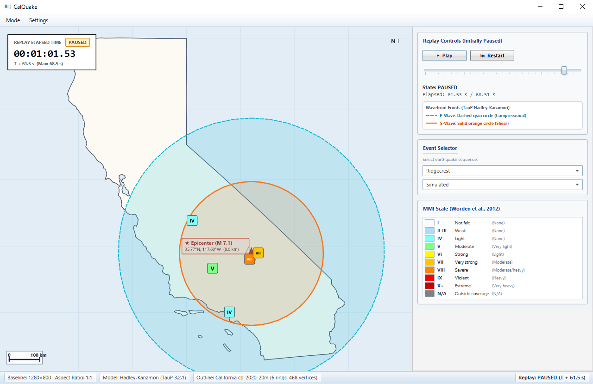

# CalQuake: California Earthquake Replay

> **Offline two-mode seismic replay for Ridgecrest (2019) and Northridge (1994)**
> Built with Java 21, JavaFX 21, TauP 3.2.1, frozen USGS inputs, BSSA14, and Worden 2012.



---

## Summary

CalQuake is an offline seismic visualization desktop application for the **2019 M 7.1 Ridgecrest** (`ci38457511`) and **1994 M 6.7 Northridge** (`ci3144585`) earthquakes. Each event supports two replay modes:

- **Recorded** (default) reveals the stored historical USGS ShakeMap peak MMI at each city when its modeled S wave arrives. These city values are ShakeMap samples, not waveform recordings.
- **Simulated** predicts median PGV from event, finite-rupture, mechanism, Rjb, and Vs30 inputs using base/no-basin BSSA14. A deterministic P/S envelope supplies relative time development, and Worden et al. (2012) converts the running peak PGV to a non-decreasing MMI display. Historical MMI/PGA/PGV values are evaluation targets only and never predictor inputs.

The application features:

- **Dynamic deterministic replay:** Each prepared event/mode owns its duration, timeline, and input signature. Playback is monotonically clocked at 1&times; speed with Play, Pause, Restart, and seeking.
- **Physical Wavefront Modeling:** Expanding compressional P-wave (dashed cyan circle) and shear S-wave (solid orange circle) calculated via the published **Hadley–Kanamori (1977)** crustal velocity model and the **TauP 3.2.1** seismic ray engine.
- **Prepared, progressive intensity:** Recorded badges reveal once; Simulated badges rise as the predicted running maximum and never decrease.
- **Safe background switching:** Event/mode changes pause and reset playback, prepare off the JavaFX thread, reject stale results, and cache immutable replays for the session.
- **Geodetic Accuracy:** Standard conformal Mercator projection on a reference 6,371 km sphere ensuring static state boundaries, true vertical orientation, and exact physical geodesic wavefront modeling.
- **Self-Contained & Offline:** Live preparation and playback are Java-only, use bundled resources, and perform no network or Python work.

---

## Prerequisites & Environment

| Component | Requirement | Notes |
| :--- | :--- | :--- |
| **Primary OS** | **Windows 10 / 11 (x86_64)** | Validated baseline; cross-platform profiles provided for macOS and Linux. |
| **Java Development Kit** | **JDK 21 LTS** | Recommended: [Eclipse Temurin 21](https://adoptium.net/temurin/releases/?version=21). |
| **Build Tool** | **Maven 3.9+** | Included Maven Wrapper (`mvnw` / `mvnw.cmd`) ensures reproducible builds. |

---

## Build Commands

### Windows (PowerShell)

```powershell
# 1. Clean build and run tests
.\mvnw.cmd clean verify

# 2. Launch the app
.\mvnw.cmd javafx:run
```

### Linux / macOS (Bash)

```bash
# 1. Grant execute permissions to wrapper (if needed)
chmod +x mvnw

# 2. Clean build and run tests
./mvnw clean verify

# 3. Launch the app
./mvnw javafx:run
```

---

## Scientific benchmark

```powershell
.\mvnw.cmd -Dtest=MmiBenchmarkRunnerTest test
```

This writes `site-results.csv`, `summary.json`, and `report.md` under `target/mmi-benchmark`. The station-PGV and city-ShakeMap cohorts remain separate, input signatures exclude evaluation targets, and unavailable waveform threshold timing is explicitly censored.

The scientific configuration, equations, domains, limitations, data provenance, and frozen hashes are documented in [`docs/instantaneous-mmi.md`](docs/instantaneous-mmi.md).

---

## Attribution & Data Sources

- **USGS Earthquake Hazards Program**: Event catalog metadata and ComCat origin parameters for `ci38457511`.
- **Southern California Earthquake Data Center (SCEDC)**: Phase catalog arrival observations (`38457511.phase`) and seismic station metadata (`scedc_stations.xml`).
- **USGS ShakeMap Atlas**: Archived Ridgecrest and Northridge finite-rupture, station, MMI, and SVEL/Vs30 products; exact product IDs and hashes are frozen in `scientific_inputs.json`.
- **Boore, Stewart, Seyhan, & Atkinson (2014)**: NGA-West2 BSSA14 ground-motion equations, base/no-basin deterministic median PGV configuration.
- **Worden et al. (2012)**: California PGV-to-MMI ground-motion/intensity conversion.
- **Cua & Heaton (2009)**: Phase-separated empirical envelope architecture used as the starting point for the documented deterministic relative P/S shape.
- **U.S. Census Bureau**: 2020 Gazetteer Places and 2020 Cartographic Boundary shapefiles for California state outline.
- **Hadley, D. M., & Kanamori, H. (1977)**: *Seismic structure of the Transverse Ranges, California.* Geological Society of America Bulletin, 88(10), 1469-1478.
- **TauP Toolkit**: Crotwell, H. P., Owens, T. J., & Ritsema, J. (1999). *The TauP Toolkit: Flexible seismic travel-time and ray-path utilities.* Seismological Research Letters, 70(2), 154-160.
- **GeographicLib-Java**: Karney, C. F. F. (2013). *Algorithms for geodesics.* Journal of Geodesy, 87(1), 43-55.
